<p align="center">
  
</p>

<table>
<tr>
<td width="36%" align="center" valign="middle">
  
  <br/>
  <a href="https://github.com/mani6409?tab=followers"></a>
</td>
<td width="64%" valign="middle">

### 👋 Hi, I'm Mani

I build **full-stack web platforms** end to end, from the database rules to the last pixel, and I
like the deeper layers too: **search engines, interpreters and diff algorithms**.

```ts
const mani = {
  role: "Full-stack developer",
  building: "SSB Academy — a role-based SSB preparation platform",
  languages: ["TypeScript", "Python", "Java", "SQL"],
  stack: ["Next.js", "React", "Node.js", "Express", "Supabase", "PostgreSQL"],
  interests: ["secure multi-tenant apps", "search & IR", "language design"],
  testing: ["Vitest", "Playwright", "SQL checks under RLS"],
};
```

</td>
</tr>
</table>

## 🛠️ Tech stack

<p align="center">
  <br/><br/>
  <br/><br/>
  
</p>

## 🚀 Now building: SSB Academy

<a href="https://github.com/gaurav-vv/EliteCadet-ssb"></a>

A preparation platform for India's **Services Selection Board** interview, serving students, mentors,
academies and a platform team. What I built:

- 🔐 **Security:** RBAC and **academy isolation enforced in Postgres row-level security**, so a bug in the app can't leak another academy's data
- 🗓️ **Training workflow:** batches, **session scheduling** (no double-booking) and **assessments** with mentor feedback
- 📈 **Insight:** progress tracking, role **dashboards**, **notifications** written by database triggers, and **platform analytics**
- 🎯 **Practice:** a **5-day practice journey**, with answers saved to each student's account and tests scored on the server
- ✅ **Testing:** unit, integration and Playwright tests, plus an **85-check SQL workflow** run as every role

<br clear="right"/>

## 📌 Featured projects

<p align="center">
  <a href="https://github.com/mani6409/SSBGuider"></a>
  <a href="https://github.com/mani6409/Zara_CompilerDesigning"></a>
  <a href="https://github.com/mani6409/Uniflow"></a>
  <a href="https://github.com/mani6409/AstroBharat--Chatbot"></a>
</p>

| | Project | What it is | Stack |
|:-:|---|---|---|
| 🪖 | [**SSBGuider**](https://github.com/mani6409/SSBGuider) | SSB preparation app: OIR question banks, psych-test practice (WAT, SRT, SD, TAT), GTO guidance, progress tracking | JavaScript |
| 🧩 | [**Zara Interpreter**](https://github.com/mani6409/Zara_CompilerDesigning) | My own small language: variables, arithmetic, conditionals, loops and a C-style `for`, interpreted in Java | Java |
| ⚙️ | [**UniFlow**](https://github.com/mani6409/Uniflow) | Durable, observable application workflows (admissions, hiring, scholarships) on one runtime with Motia | TypeScript · Motia |
| 🤖 | [**AstroBharat Chatbot**](https://github.com/mani6409/AstroBharat--Chatbot) | Chatbot query layer, Express API, data seeding and an embeddable chat widget | JavaScript · Express |

<details>
<summary><b>More projects</b></summary>
<br/>

| | Project | What it is | Stack |
|:-:|---|---|---|
| 🔍 | [**Search Engine Model**](https://github.com/mani6409/SearchEngineModel) | A small search engine: preprocessing, Porter stemming, indexing, ranked retrieval | Python |
| 🧮 | [**Myers diff**](https://github.com/mani6409/myers-diff-algorithm) | An implementation of the Myers diff algorithm, with tests and samples | Python |
| 📚 | [**SEIR Projects**](https://github.com/mani6409/SEIR_Projects) | Search Engines & Information Retrieval: IR models, indexing and ranking implementations | Python |
| 🌿 | [**Virtual Herbal Garden**](https://github.com/mani6409/Virtual-Herbal-Garden) | 3D medicinal plants with uses, habitat and cultivation, search filters and virtual tours | TypeScript · React · Vite |
| 🌦️ | [**Weather Analysis**](https://github.com/mani6409/Weather-Analysis-Project) | 50 years of Indian weather data, interactive charts and a 3D temperature view | JavaScript |
| 🛒 | [**Shopora storefront**](https://github.com/mani6409/Ecommerce_website) | A single-file responsive storefront for desktop, tablet and mobile, with no build step | HTML · CSS · JS |

</details>

## 📊 GitHub activity

<p align="center">
  
  
</p>
<p align="center">
  
</p>

<p align="center">
  <picture>
    <source media="(prefers-color-scheme: dark)" srcset="https://raw.githubusercontent.com/mani6409/mani6409/output/github-snake-dark.svg" />
    <source media="(prefers-color-scheme: light)" srcset="https://raw.githubusercontent.com/mani6409/mani6409/output/github-snake.svg" />
    
  </picture>
</p>

## 🌱 Open source

Merged contributions to:

- **[TravellersMeet/travellers](https://github.com/TravellersMeet/travellers)**: 11 merged PRs, including an AI travel widget with dark mode, a redesigned auth flow and UI refinements
- **[gaurav-vv/EliteCadet-ssb](https://github.com/gaurav-vv/EliteCadet-ssb)**: the SSB Academy platform, from the RBAC foundation onwards
- **[Yugenjr/College_Companion](https://github.com/Yugenjr/College_Companion)**: a theme toggle

---

<p align="center">
  <sub>Always up for collaborating on interesting projects. Open an issue on any repo, or <a href="https://github.com/mani6409">follow along here</a>.</sub>
</p>
